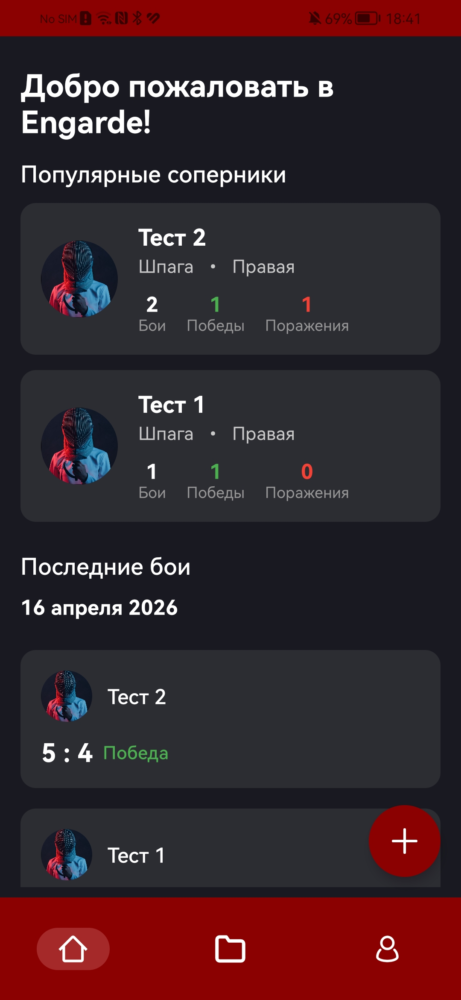
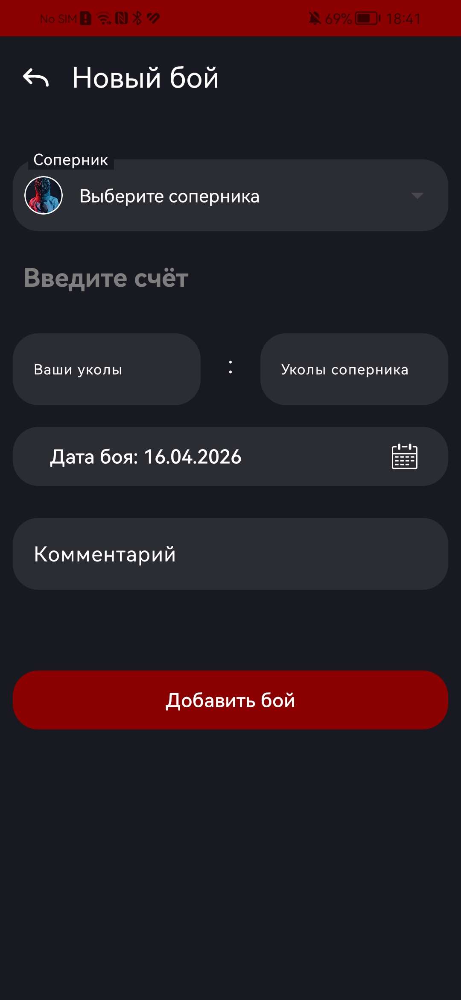
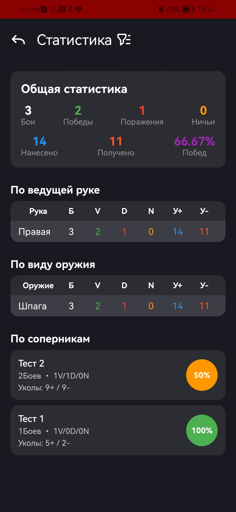
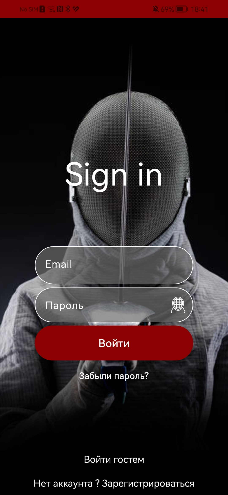

# Engarde — Fencing Battle Diary

[](https://developer.android.com)


**Engarde** — это мобильное приложение для фехтовальщиков, которое помогает вести дневник тренировочных и турнирных боёв, отслеживать прогресс и анализировать статистику. Больше никаких блокнотов и потерянных записей.

> Проект активно развивается. В планах — поддержка других видов спорта.

## 📱 Скриншоты

| Главный экран | Добавление боя | Статистика | Авторизация |
|---------------|----------------|-------------|--------------|
|  |  |  |  |

## ✨ Возможности

- **Записи о боях** — добавляй дату, соперника, вид оружия (шпага/рапира/сабля), счёт и количество ударов (нанесённые / полученные).
- **Редактирование и удаление** — управляй своими записями.
- **Фильтрация** — по дате и виду оружия.
- **Статистика** — таблица с показателями:
  - Всего боёв
  - Победы / Поражения
  - Процент побед
  - Всего нанесённых уколов
  - Всего полученных уколов
- **Экспорт / Импорт в Excel** (`.xlsx`) — делись данными или восстанавливай из бэкапа.
- **Авторизация через Firebase Auth** — можно работать без входа, но при авторизации данные синхронизируются в облако.
- **Резервное копирование** — Firebase Realtime Database + Supabase Storage.
- **Офлайн‑режим** — локальное хранение через Room. Приложение работает полностью без интернета.

## 📲 Установка

### Для обычных пользователей
1. Перейди в раздел [Releases]((https://github.com/asiafrolova/FenRank/releases) (ссылка станет активной после публикации)
2. Скачай файл `engarde.apk`
3. Разреши установку из неизвестных источников (потребуется один раз)
4. Открой APK и установи приложение

### Для разработчиков
```bash
git clone https://github.com/ТВОЙ_АККАУНТ/engarde.git
